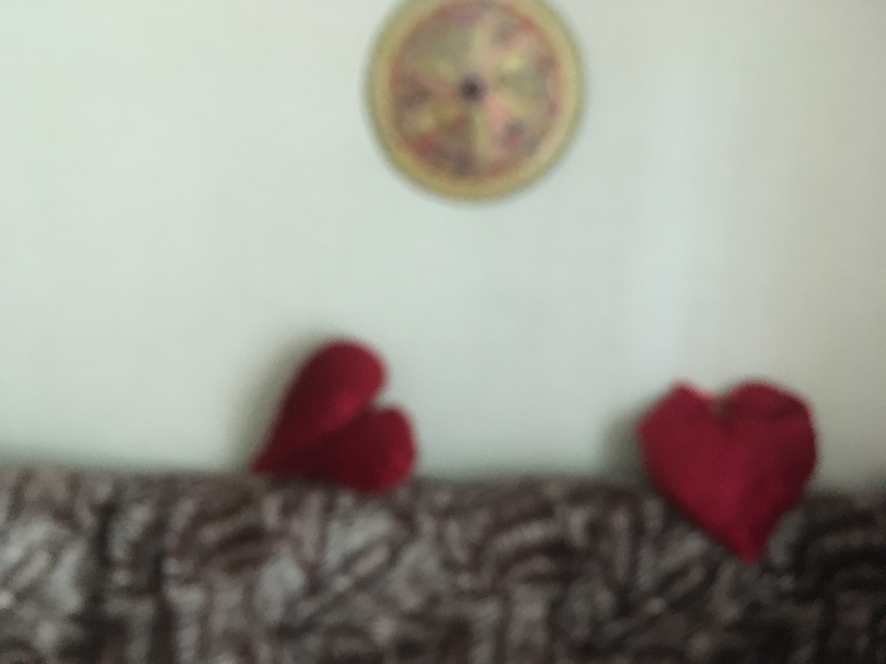
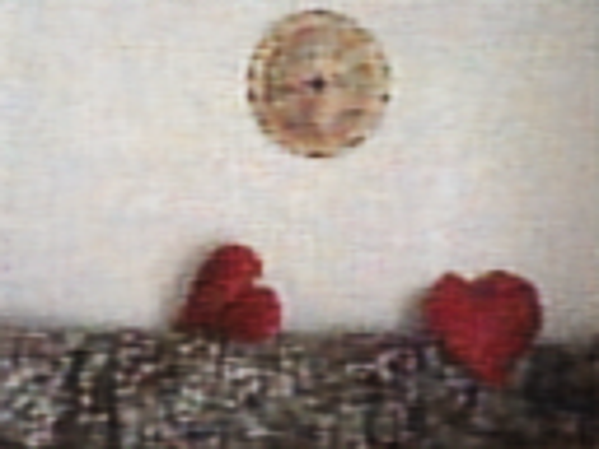

# Deblurify: *Deblurring images using Autoencoders*

This project was developed as part of the **Artificial Intelligence** course at the Faculty of Electrical Engineering, University of Sarajevo (academic year 2024/2025).

## Project Description

**Deblurify** is a deep learning-based solution for removing blur from images using autoencoders. The goal is to restore the original, sharp version of an image that has been degraded by motion blur or defocus. This project demonstrates how convolutional neural networks (CNNs), specifically autoencoder architectures, can be used to solve real-world image restoration problems.
## Getting Started

### 1. Clone the repository

git clone https://github.com/lanamal/deblury.git

cd deblury

### 2. Install dependencies

pip install -r requirements.txt

### 3. Run the Streamlit app

streamlit run app/app.py

## Model Overview

The model is based on a **convolutional autoencoder** architecture, and optionally utilizes the **UNet** design. It is trained on pairs of blurred and sharp images. The training process minimizes the Mean Squared Error (MSE) between the predicted and target images.

**Training Features:**

- Optimizer: Adam

- Loss Function: MSE

- Evaluation Metrics: PSNR, SSIM

- Input Size: 128x128 (can be adjusted)
## Results

The model successfully restores unblurred images with an accuracy of about *80%*.

| Blurred Image         | Deblurred Output        |
| --------------------- | ---------------------- |
|         |           |

## Web Application

A **Streamlit**-based UI is included to allow easy testing and demonstration. Users can:

- Upload the blurred images

- Compare results visually using image sliders (before/after)

- See the percentage match with the original image

- Download the deblurred image

- View a gallery of previously uploaded images and results
## Authors

This project was developed by:

- Alma Jusufbegović

- Naida Hasović

- Lana Malinov
